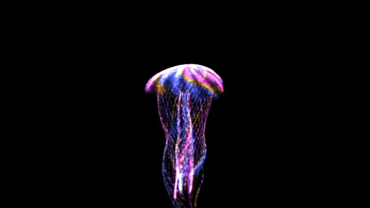
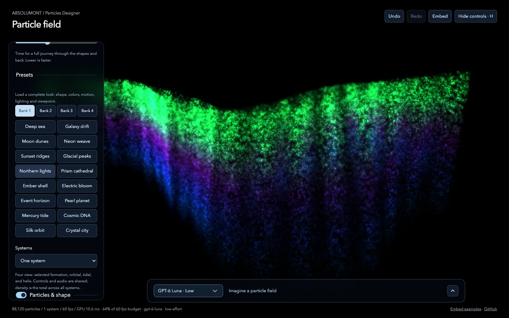

# Particles Designer

<a href="https://rezakalfane.github.io/ParticlesDesigner/"></a>

**ABSOLUMONT / Particles Designer** — author luminous GPU particle fields in the
browser: 1k–200k procedural WebGL2 points forming built-in, baked or AI-invented
shapes, with light, ribbons, attractors, motion, shockwaves, a collapse → explode →
reform cycle and audio reactivity. Browse four banks of factory looks and shapes,
save your own, describe a field in words (optionally with an inspiration photo),
and play it all from a ROTO-CONTROL. Then drop any look into a web page with the
embed kit.

Originally built inside LUMEN; this repository is the standalone tool.

**Live:** [Designer](https://rezakalfane.github.io/ParticlesDesigner/) ·
[embed examples](https://rezakalfane.github.io/ParticlesDesigner/examples/). The
hosted Designer runs fully in the browser: saved slots stay in that browser, and AI
generation needs the local host (below).



## Quick start

```sh
npm install
npm run dev          # http://localhost:5180/
```

Chrome or Edge is recommended (Web MIDI for ROTO-CONTROL; WebGL2 required).

### AI design generation (optional)

The prompt bar calls the local dev host at `/api/generate`, which talks to OpenAI
server-side. Copy `.env.example` to `.env.local`, fill in `OPENAI_API_KEY`, and
restart `npm run dev`. The key is never sent to the browser, and generation only
accepts loopback requests.

### Saved slots

Saved presets and shapes are written by the dev host to one JSON library
(`~/Library/Application Support/Particles Designer/slots.json` on macOS; override
with `PARTICLES_DESIGNER_DATA_DIR`), so every device that opens the dev server
shares them. Browser storage is the fallback when no host is available.
`npm run bake` turns saved work into factory code (see docs).

## Embed a look in any web page

```html
<script type="module" src="particles-designer.js"></script>
<particle-field look="deep-sea" style="width: 100%; height: 480px"></particle-field>
```

```js
import { ParticleField } from "./particles-designer.js";
const field = new ParticleField("#hero", {
  look: "galaxy-drift",
  audio: "microphone",
  audioDepth: 1,
});
```

In the Designer, **Embed** copies a ready-to-paste snippet of the current look or
downloads it as JSON. `npm run build:embed` builds the kit (about 30 KB gzipped,
no dependencies) and `npm run examples` opens the sample pages. See
[docs/EMBED.md](docs/EMBED.md).

## Scripts

| Command                  | What it does                                                      |
| ------------------------ | ----------------------------------------------------------------- |
| `npm run dev`            | Vite dev server with the Designer host APIs (LAN-exposed)         |
| `npm run build`          | Typecheck + static build in `dist/`                               |
| `npm run preview`        | Serve the build with the host APIs                                |
| `npm test`               | Unit tests (Vitest)                                               |
| `npm run build:embed`    | Build the embed kit into `dist-embed/` (ESM, IIFE, types)         |
| `npm run build:site`     | App + kit + examples as one static site in `dist/` (GitHub Pages) |
| `npm run examples`       | Build the kit and open the embed examples                         |
| `npm run verify`         | Format check, typecheck, tests, app and embed builds              |
| `npm run bake`           | Bake the saved slot library into factory shapes/looks             |
| `npm run roto:presets`   | Regenerate the ROTO-CONTROL setup files in `roto/`                |
| `npm run rehearse:roto`  | Browser rehearsal with simulated Web MIDI (needs `npm run dev`)   |
| `npm run rehearse:embed` | Browser rehearsal of every embed example (needs `npm run dev`)    |

## Layout

```
index.html            Designer page
src/engine/           WebGL2 particle renderer, custom geometry compiler, baked shapes, cycle
src/looks/            Factory catalog: looks, studies, baked looks, 4×16 factory slots
src/designer/         Designer UI: main loop, design schema, banks, dialogs, history, ROTO layout
src/roto/             ROTO-CONTROL Web MIDI driver and setup parser
src/embed/            Embed kit: ParticleField runtime, audio, <particle-field>, snippets
examples/             Embed sample pages (+ a custom design JSON)
server/               Dev-host APIs: AI generation (/api/generate), saved slots (/api/slots)
scripts/              Bake, ROTO preset generation, browser rehearsals
roto/                 ROTO-SETUP files (MIDI channels 9–11)
docs/                 DESIGNER.md (reference), EMBED.md (embed kit), ROTO-CONTROL.md (hardware)
tests/                Vitest suites
```

Below the embed kit, `ParticleRenderer` (src/engine/renderer.ts) is the raw seam:
`render(timeMs, drive)` every frame and `dispose()` when done. It owns no loop,
clock, DOM or audio.

## Roadmap

- Electron packaging (desktop app hosting the same APIs)
- Documentation site
- Publish the embed kit to npm / a CDN

## License

[MIT](LICENSE) © 2026 Reza Kalfane, Absolumont Collective
